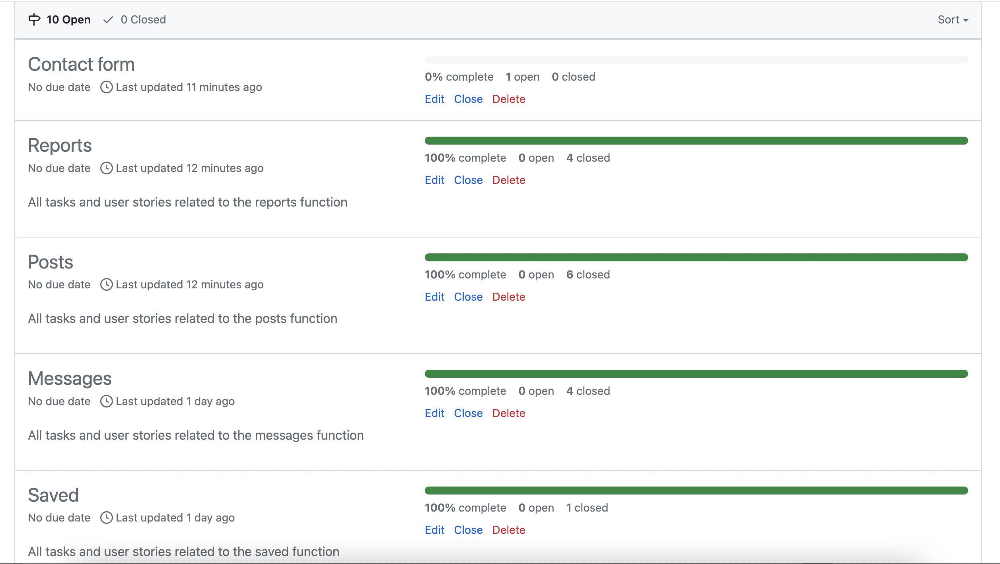
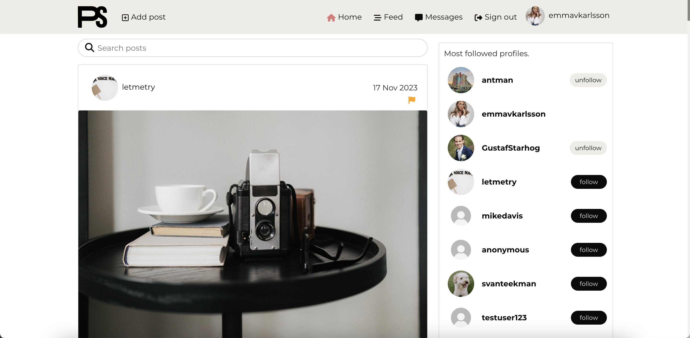
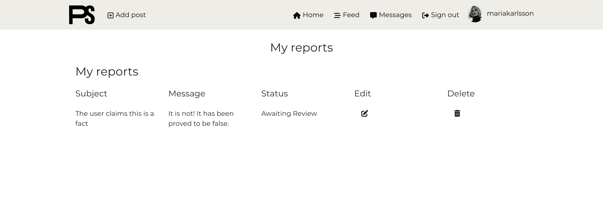
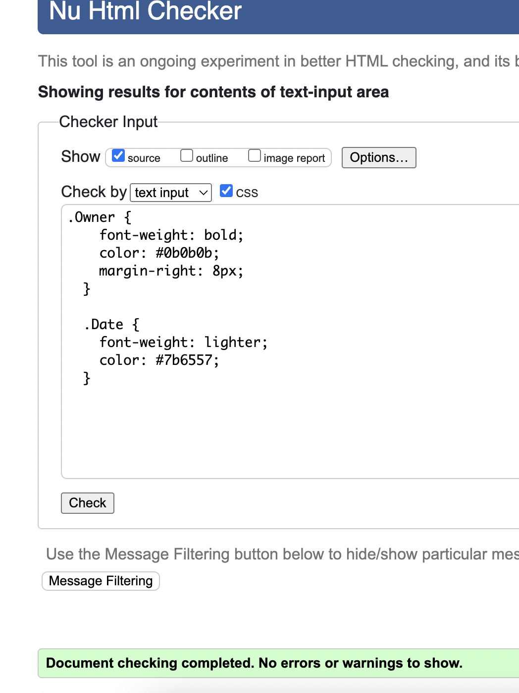
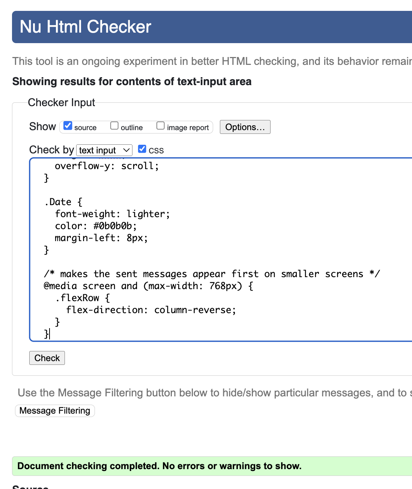
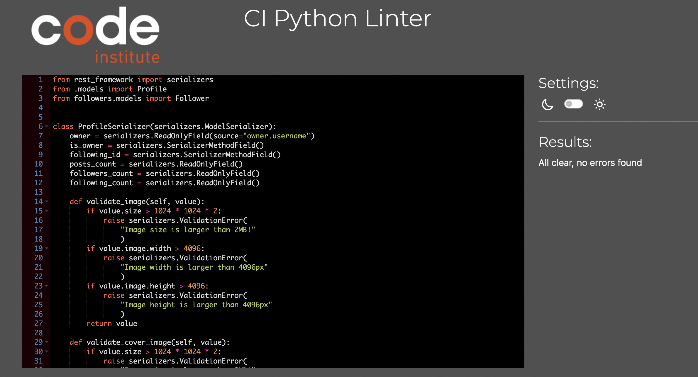

# Portfolio Project 5 (Code Institute) - Advanced Front End
## Introduction
PhotoStream is a dynamic photosharing website that let's users share images with each other, follow other accounts, commenting on posts and liking and saving posts. Beyond photo sharing, it also allows users to communicate through messaging, and also to uphold community standards by reporting inappropriate content. 

Deployed project: [Link](https://evk-pp5-cf55770a5b07.herokuapp.com/).

---
## Table of Contents

 - ## [Introduction](#introduction-1)

 - ## [Table of Contents](#table-of-contents-1)
 
 - ## [Project Goals](#project-goals-1)

 - ## [UX](#UX-1)

 - ## [User Stories](#user-stories-1)

 - ## [FlowChart](#flowchart-1)

 - ## [Features](#features-1)

 - ## [Reusable Components](#reusable-components-1)
 
 - ## [Testing Frontend](#testing-frontend-1)
    - ### [Automated testing](#automated-testing-2)
    - ### [Manual Testing](#manual-testing-2)

- ## [Testing Backend](#testing-backend-1)
    - ### [Automated testing](#automated-testing-3)
    - ### [Manual Testing](#manual-testing-3)

- ## [Deployment](#deployment-1)

---

## Project Goals
This project aimed to create a website for sharing photos easily. My goal was to let people upload, view, and comment on pictures in a friendly online space. To keep the website friendly, I have added a report function that let's users report images that doesn't follow community guidelines. I wanted users to interact by commenting, liking, and following others. I have also added a messaging system for conversing with other users without anyone else seeing the messages. I also wanted to add a save picture function, so that users could save their images in own place, without it being visible for anyone else than them. My goal was to make a simple website which is easy to navigate. I also wanted to encourage people to sign up by disabling certain functionality for logged out users.

## UX
### Colors
I have chosen 3 main colors for my page, these are:
#0b0b0b, a dark, almost black color
#efede6, a light beige color
#7b6557, a brown color
#ffffff
These colors are used for most of the buttons, the text as well as the Navbar. 

### Font
I have used Montserrat in my project, which is a popular sans-serif font among designers, and is available on Google Fonts.

## User Stories

I have used GitHub project to manage my tasks and user stories. All user stories have their own requirements and tasks, which makes it easy to set up the workflow and sprints. GitHub uses "milestones", as sprints. I have categorized my User Stories with 3 different labels: must have, should have and could have. 1 user story was not implemented, categorized "should have", as I did not have enough time to finish it. 
The milestones are grouped into 7 differents sprints, where one milestone contains all tasks and user stories related to a feature, as it makes the workflow a lot easier when you can focus on one function at a time. For example, all tasks / user stories related to the reports function, is part of the Milestone "Reports" and the tasks/user stories were all implemented in the same sprint.

Link to GitHub project [Here](https://github.com/users/emmavkarlsson/projects/4)

Kanban board

Milestones 1

Milestones 1

## Flowchart

Lucidchart Flowchart

## Features
### Navbar
The navbar is visible for all users visiting the page, but what is displayed are different based on if you are logged in or not.
#### Visible for all users
Brand logo
Home icon / link
#### Visible for logged out users only
Sign in icon / link
Sign up icon / link
#### Visible for logged in users only
Add post icon / link
Feed icon / link
Messages icon / link
Sign out icon / link
User Avatar / link
Username / link

Navbar - logged out users

Navbar - logged in users

### HomePage
The homepage displays all shared posts in chronological order showing the latest post first. They are displayed with an infinite scroll, meaning that after 10 posts, the page loads another 10 posts. This is for both logged in and not logged in users, however it's displayed a little differently based on the current log in status. The HomePage also provides a search bar for users to search different keywords that will filter on post and profile.

#### *Visible for all users*
Shared posts in chronological order, latest post first, with infinite scroll. The user can see who has posted the image and the image title. The image links to the post, and the avatar/username links to the profile. 
The search bar is visible for all users.

#### *Visible for not logged in users*
Users who are not logged in, are greeted with the text "Welcome to PhotoStream", and below it, the shared posts displayed horizontally. The user can scroll through the posts horizontally and infinitely. 

#### *Visible for logged in users*
Users who are logged in can see the posts displayed vertically and can scroll through them infinitely. Compared to logged out visitors, logged in users can see the description of the post, a heart icon with a likes count that let's them like the post and see how many likes the post have, a comment icon that links to the post page, and a saved button that let's them save the post. They can also see when each post was posted, a report icon that let's them report the post, as well as a container of the most popular profiles, displayed on the right hand side of the posts (on desktop, on mobile it is displayed above the posts). 

Home Page - logged out users

Home Page - logged in users

### Sign up Page
The sign up page is accessed through the navbar when visitors are not logged in, or through a link on the Sign In page. By clicking sign up in the navbar, the user is taken to the sign up page where they can create an account. 
The page consists of two columns, where one is the Sign Up form and the other is an image relevant to the website. The image is only visible on desktop view. The sign up form has a field for username, a password field as well as a confirm password field. If a user has accidentally ended up on the Sign Up page, when they were supposed to Sign In, there's a link under the sign up button that sends the user to the Sign In page instead. When a user has provided accepted credentials for an account and clicked the Sign Up button, they are sent to the sign in page.

Sign up page

### Sign In Page
The Sign In page is accessed through the navbar when visitors are not logged in, or through a link on the Sign Up page. By clicking sign in in the navbar, the user is taken to the sign in page where they can log in.
The page consists of two columns, where one is the Sign In form and the other is an image relevant to the website. The image is only visible on desktop view. The Sign In form has a field for username and a field for password. If a user has accidentally ended up on the Sign In page, when they were supposed to Sign Up, there's a link under the Sign In button that sends the user to the Sign Up page instead. When a user has provided a valid username and password, they are sent to the homepage for logged in users and the navbar updates. 

Sign in page

### Feed Page
The feed page looks exactly like the homepage, but with the difference that it only contains posts from profiles which the logged in user is following. Just like the homepage, it also has a Popular Profiles container.

Sign in page

### Create Post Page	
The Create Post Page is accessed through an icon with text in the navbar, displayed on the left and side next to the brand logo. This page is only accessible for logged in users, and if visitors who are not logged in try to access the page, they get sent to the homepage. 
The Create Post Page contains of two columns, on the left hand side you can upload an image, and on the right hand side you can provide a title and a description of your image. The user can choose to cancel, and gets sent to the homepage. If a user submits a post, they will get sent to the post detail page for the post they uploaded.

Create post page - empty 

Create post page - filled out

### Liked Posts Page
Liked posts can be accessed through a link in the users profile page "Liked Posts". The Liked Posts Page looks and works like the Home Page, with the difference being that it's only showing the posts that the user has liked. If a user unlikes a post, it will be removed from the Liked Posts Page when the page is refreshed.

Liked page

### Saved Posts Page
Saved Posts can be accessed through a link in the users profile page "Saved Posts". The Saved Posts Page looks and works like the Home Page, with the difference being that it's only showing the posts that the user has saved. If a user unsaves a post, it will be removed from the Saved Posts Page when the page is refreshed.

Liked page

### Profile page
The profile page shows the users username, coverphoto (a default coverphoto if they haven't added one), the profile picture (a default profile picture if they haven't added one), their name (if they have provided it), bio (if they have provided it), as well as the number of posts, followers and following the user has. The Popular Profile container is displayed just like on the homepage, and all the posts the user has posted.

#### *Logged in, viewing someone else's profile*
If the user is logged in and is viewing someone else's profile, they can also see a follow/unfollow (based on current condition) button. When clicked, the user will unfollow/follow the person. Under the bio, there's a send message button, that let's the logged in user send a message to the user who's profile they are currently viewing. 

#### *Not logged in, viewing someone's profile*
If a visitor of the page is not logged in, it won't see the "follow" button, nor the "Send Message" in the profile information's section.

#### *Logged in, viewing their own profile*
If a user is viewing their own profile, neither the "send message" box nor the "follow/unfollow" button is visible. On the right hand side of the profile (or above, on mobile), two buttonlinks are visible: "My messages" and "My reports". Where the Send Message box is presented on other users profile, users can see buttonlinks for "liked posts" and "saved posts" instead. If a user is viewing it's own profile, three dots are visible next to the cover photo, which, when clicked, shows a dropdown menu. The dropdown menu contains "edit cover photo", "edit profile", "change username" and "change password", which will take them to the different pages. 

Logged in, viewing someone else's profile

Logged in, viewing their own profile

Not logged in

### Messages Page
The messages page contains the users sent and received messages, if they have any. They are displayed in two different containers, with Sent Messages on the left and Received Messages on the right. On mobile, Received Messages are placed above Sent Messages. The containers have a fixed height, and when it is filled with messages, the users can scroll through them vertically. 
Both the sent messages and received messages contain the other user's profile picture, username, the date of which the message was sent, as well as the message content. 
For each sent message, there's a three dots icon, which when clicked will let the user either update or delete the message. 

Messages page

### Create Report Page
The Create Report page is accessed through the flag icon, displayed above the image in a post for users who are logged in. It is a simple page with a form and a picture. The form contains three fields. The first is Report reason, where the user get's to choose an option as to why they want to report the image. The other two fields are Subject and Message, where the user can explain why they are reporting the image. 
Under the form are two buttons, cancel and report. Cancel will send the user back to the page it came from without submitting the report, while the report page will submit the report.

Create Report page

### Reports List Page
The reports list page, or "My Reports" is accessed through a users own profile. The Reports List Page is a simple page where the user can see all the reports it has filed, with the subject and message details. It can see the current status of the report (either Awaiting Review, Reviewed or Closed). The user can also see an edit icon, as well as a trash can icon. The first will send the user to the Edit Report Page, while the second will let the user delete the report. 

Reports page

### Edit Reports List Page
The Edit Reports List Page looks exactly like the Create Report Page, with the only difference being the header text, and the submit button being named "update report" compared to "report".

Edit report page

### Edit Profile Page
The Edit Profile Page looks like the Create Post Page, but instead of Title and Content, the user can set their name as well as a bio.

Edit Profile page

### Edit Cover Photo Page
The Edit Cover Photo Page looks like the Edit profile page, but with the difference that it only has one field the user can edit, which is the image. 

Edit Cover Photo page

### Update Username Page
The update username page is a simple page with a one field form, where users can change their username.

Change username page

### Update Password Page
The update password page is a simple page with a two field form, where users can set their new password in the first field, and confirm it in the second. 

Change password page

## Components
Components are extremely handy to use, as every react component acts separately and you can import the component wherever you like. This means, you can change a part of your code in one place, and don't have to do the same update in multiple different files. This also means you can use the same component in each area of the app and change the individual pieces. Updates become more streamlined, reducing the overall update workload and enhancing efficiency. It also makes it a lot easier to fix errors, as you only have to fix it in one place. 

I have a couple different components that I have separated into their own files and then reused on other pages. These are:
* Navbar
	* Is used on all pages on the platform
* Avatar - the avatar is displayed on 
	* Posts
	* Profile page
	* Comments
	* Messages
	* Popular Profiles
	* Navbar.
* MoreDropDown - the MoreDropDown component is used on
	* Posts
	* Profile
	* Sent Messages
	* Comments.
* Asset - the asset is a spinner which is used when something is loading. It is used on the
	* Home Page when loading posts
	* Posts Page when loading posts
	* Profile Page when loading posts
	* Messages Page when loading messages
	* Reports Page when loading reports. 

Navbar component

Avatar component post

Avatar component profile

Avatar component comment

Avatar component messages

Avatar component popular profiles

More dropdown component profile

More dropdown component comment

More dropdown component messages

More dropdown component posts

Asset spinner

 
Besides from these, I have multiple other components like Popular Profiles, which is imported to the Home Page as well as the Profile Page (when viewing someone else's profile).

## Testing Frontend
### Automated testing
#### HTML
I have used the W3C Code Validator to test my HTML. The results showed no errors or warnings, but 9 info messages all informing about trailing slashes.

W3C HTML Validation

#### CSS
I have used the W3C Validator to validate my CSS. All CSS files came back with no errors.

App.module.css

index.module.css

Asset.module.css

Avatar.module.css

Button.module.css

Comment.module.css

CommentCreateEditForm.module.css

MoreDropDown.module.css

NavBar.module.css

Post.module.css

PostCreateEditForm.module.css

PostsPage.module.css

Profile.module.css

ProfilePage.module.css

Reports.module.css

SignInUpForm.module.css

UserMessage.module.css

### Manual testing
#### Home Page

* User is not logged in

|Feature  | Action | Expected result | Pass/Fail |
|--|--|--|--|
| Navbar | Display | The Brand logo is visible | Pass |
| Navbar | Display | The Home button is visible | Pass |
| Navbar | Display | The Sign in link is visible | Pass |
| Navbar | Display | The Sign up link is visible | Pass |
| Navbar | Display | No other icons are visible | Pass |
| Content | Display | The latest posts are visible | Pass |
| Content | Display | The welcome message is visible | Pass |
| Content | Display | The Search Bar is visible | Pass |
| Navbar | Click | The Brand Logo leads to the home page | Pass |
| Navbar | Click | The Home link leads to the home page | Pass |
| Navbar | Click | The Sign In link leads to the Sign In Page | Pass |
| Navbar | Click | The Sign Up link leads to the Sign Up page | Pass |
| Search bar | Search | Images related to the search word shows up when searched | Pass |
| Content | InfiniteScroll | The posts loads infinitely when scrolling through them | Pass |

* User is logged in

|Feature  | Action | Expected result | Pass/Fail |
|--|--|--|--|
| Navbar | Display | The Brand logo is visible | Pass |
| Navbar | Display | The Add post icon is visible | Pass |
| Navbar | Display | The Home button is visible | Pass |
| Navbar | Display | The Feed link/icon is visible | Pass |
| Navbar | Display | The Messages link/icon is visible | Pass |
| Navbar | Display | The Signout link/icon is visible | Pass |
| Navbar | Display | The user avatar is visible | Pass |
| Navbar | Display | The username is visible | Pass |
| Navbar | Display | No other icons are visible | Pass |
| Content | Display | The latest posts are visible | Pass |
| Content | Display | The Most Popular Profiles are visible | Pass |
| Content | Display | The Search Bar is visible | Pass |
| Navbar | Click | The Brand Logo leads to the home page | Pass |
| Navbar | Click | The Add Post link leads to the create post page | Pass |
| Navbar | Click | The Home link leads to the home page | Pass |
| Navbar | Click | The Feed link leads to the Feed Page | Pass |
| Navbar | Click | The Messages link leads to the Messages page | Pass |
| Navbar | Click | The Sign Out link opens a modal to confirm the signout | Pass |
| Navbar | Click | The Avatar & username link leads to the profile page | Pass |
| Sign out modal | Click | Clicking sign out logs me out | Pass |
| Sign out modal | Click | Clicking sign out sends me to the home page | Pass |
| Sign out modal | Click | Clicking cancel leaves me logged in | Pass |
| Search bar | Search | Images related to the search word shows up when searched | Pass |
| Content | InfiniteScroll | The posts loads infinitely when scrolling through them | Pass |
| Post | Click | Clicking the heart icon likes the posts if it's someone else's post | Pass |
| Post | Click | Clicking the heart icon adds to the likes count if it's someone else's post | Pass |
| Post | Click | Clicking the heart icon doesn't like the posts if it's my post | Pass |
| Post | Click | Clicking the heart icon doesn't add to the likes count if it's my post | Pass |
| Post | Click | Clicking the comment icon sends me to the post page | Pass |
| Post | Click | Clicking the saved icon saves the posts if it's someone else's post | Pass |
| Post | Click | Clicking the saved icon doesn't save the posts if it's my post | Pass |
| Post | Click | Clicking the report icon sends me to the create report page if it's not my post | Pass |
| Post | Click | Clicking the Image of a posts sends me to the Post Detail Page | Pass |
| Post | Click | Clicking the Avatar/Username of the post owner sends me to the Profile Page of the user | Pass |
| Popular Profiles | Click | Clicking the Avatar of a user sends me to the Profile Page | Pass |
| Popular Profiles | Click | Clicking the username of a user sends me to the Profile Page | Pass |
| Popular Profiles | Click | Clicking follow makes the user follow a profile | Pass |
| Popular Profiles | Click | Clicking unfollow makes the user unfollow the profile | Pass |
| Popular Profiles | Display | No follow button appears next to my own profile | Pass |

#### Feed Page
|Feature  | Action | Expected result | Pass/Fail |
|--|--|--|--|
| Post | Display | Only posts by followed users shows up | Pass |
| Search bar | Display | The display bar is displayed | Pass |
| Search bar | Search | Only posts by followed users shows up | Pass |
| Search bar | Search | The "no posts found" shows up if there's no match to the search | Pass |
| Popular Profiles | Display | Popular profiles show up | Pass |
| Popular Profiles | Click | The same functionality as on the Home Page works for Popular Profiles | Pass |
| Post | Click | Clicking the Avatar/Username of the post owner sends me to the Profile Page of the user | Pass |
| Post | Click | Clicking the heart, comment, saved and report icons works in the same way as on the Home Page | Pass |

#### Liked Posts
|Feature  | Action | Expected result | Pass/Fail |
|--|--|--|--|
| Post | Display | Only posts that I have liked show up | Pass |
| Post | Click | Unliking a post makes the post disappear when I refresh the page | Pass |
| Search | Click | Search results only include posts I have liked | Pass |
| Post | Display/Click | All other functionality displays and works as on the home page | Pass |

#### Saved Posts
|Feature  | Action | Expected result | Pass/Fail |
|--|--|--|--|
| Post | Display | Only posts that I have saved show up | Pass |
| Post | Click | Unsaving a post makes the post disappear when I refresh the page | Pass |
| Search | Click | Search results only include posts I have saved | Pass |
| Post | Display/Click | All other functionality displays and works as on the home page | Pass |

#### Post Detail Page
|Feature  | Action | Expected result | Pass/Fail |
|--|--|--|--|
| Post | Display | I can view comments if there is any | Pass |
| Post | Comment | I can comment on the post | Pass |
| Post | Comment | My post shows up when I have commented | Pass |
| Post | Comment | I can see a three dots icon on my comment | Pass |
| Post | Comment | I can edit my comment | Pass |
| Post | Comment | I can delete my comment | Pass |
| Post | Comment | I can not see a three dots icon on other users comments | Pass |
| Dropdown | Display | I can see a three dots icon above the post on my own post | Pass |
| Dropdown | Click | Clicking the three dots icon opens a dropdown of edit and delete | Pass |
| Dropdown | Click | Clicking the three dots icon opens a dropdown of edit and delete | Pass |
| Dropdown | Click | Clicking the edit icon leads me to the edit post page | Pass |
| Dropdown | Click | Clicking the trash icon lets me delete my comment | Pass |
| Post | Display/Click | All other functionality displays and works as on the home page | Pass |
| Alert | Display | I can see an Alert when I update my comment saying my comment has been updated | Pass |
| Alert | Display | I can see an Alert when I delete my comment saying my comment has been deleted | Pass |

#### Create post page
|Feature  | Action | Expected result | Pass/Fail |
|--|--|--|--|
| Form | Display | I can see an icon and a text telling me to click to choose an image | Pass |
| Button | Click | Clicking it opens a file browser window | Pass |
| Form | Click | I can choose I file | Pass |
| Form | Display | I can see a title field for my post | Pass |
| Form | Display | I can see a content field for my post | Pass |
| Form | Typing | Typing in the Title field works | Pass |
| Form | Typing | Typing in the Content field works | Pass |
| Button | Click | Clicking Cancel takes me back to the last visited page | Pass |
| Button | Click | Clicking Create takes me to the post page | Pass |
| Button | Click | Clicking Create adds a new post | Pass |
| Alert | Display | Clicking Create shows me an alert saying my post has been uploaded | Pass |
| Error messages | Display | An error message shows up if my file is too big | Pass |
| Error messages | Display | An error message shows up if I haven't added a title | Pass |
| Error messages | Display | An error message shows up does not show up if I haven't added any text content | Pass |

#### Edit post page
|Feature  | Action | Expected result | Pass/Fail |
|--|--|--|--|
| Form | Display | I can see the image for my post | Pass |
| Form | Display | I can see the title for my post | Pass |
| Form | Display | I can see the content for my post | Pass |
| Button | Click | Clicking "change the image" opens a file browser window | Pass |
| Form | Click | Choosing a new file replaces the image | Pass |
| Form | Typing | Typing in the Title field works | Pass |
| Form | Typing | Typing in the Content field works | Pass |
| Button | Click | Clicking Cancel takes me back to the post page | Pass |
| Button | Click | Clicking Save takes me back to the post page | Pass |
| Button | Click | Clicking Save updates the post content that I changed | Pass |
| Alert | Display | Clicking Save shows me an alert saying my post has been updated | Pass |
| Error messages | Display | Error messages works as they do in the Create Post Page | Pass |

#### Profile Page
* General

|Feature  | Action | Expected result | Pass/Fail |
|--|--|--|--|
| Profile | Display | I can see an avatar | Pass |
| Profile | Display | I can see a cover photo | Pass |
| Profile | Display | I can see the username | Pass |
| Profile | Display | I can see the users´ name if they have added it | Pass |
| Profile | Display | I can see the users´ bio if they have added it | Pass |
| Profile | Display | I can see the users´ posts if they have added any | Pass |
| Profile | Display | I can see a "no results found" if they have not added any posts | Pass |
| Profile | Display | I can see the number of post the user has | Pass |
| Profile | Display | I can see the number of followers the user has | Pass |
| Profile | Display | I can see the how many people the user is following | Pass |
| Popular profiles | Display | Popular profiles is displayed on the left and works as on other pages | Pass |

* Logged in viewing someone else's profile

|Feature  | Action | Expected result | Pass/Fail |
|--|--|--|--|
| Button | Display | I can see a follow button if I don't follow the user | Pass |
| Button | Display | I can see an ufollow button if I follow the user | Pass |
| Button | Click | Clicking the follow button makes me follow the user | Pass |
| Button | Click | Clicking the follow changes the fullow button to an unfollow button | Pass |
| Button | Click | Clicking the unfollow button makes me unfollow the user | Pass |
| Button | Click | Clicking the follow changes the unfullow button to an follow button | Pass |
| Message | Display | I can see a message form with button | Pass |
| Message | Click | I can type in the message form | Pass |
| Message | Click | Clicking the send message button sends a message to the user | Pass |
| Alert | Display | Clicking the send message button gives me an alert saying the message has been sent | Pass |

* Logged in viewing my own profile

|Feature  | Action | Expected result | Pass/Fail |
|--|--|--|--|
| Menu | Display | I can see a three dot menu next to my cover photo | Pass |
| Menu | Click | Clicking the three dot menu opens up a dropdown | Pass |
| Menu | Click | Clicking "edit profile" sends me to the Edit Profile page | Pass |
| Menu | Click | Clicking "edit cover photo" sends me to the Edit Coverphoto page | Pass |
| Menu | Click | Clicking "change username" sends me to the Change Username page | Pass |
| Menu | Click | Clicking "change password" sends me to the Change Password page | Pass |
| Profile buttons | Display | I can see the Liked Posts button | Pass |
| Profile buttons | Click | Clicking the Liked Posts button takes me to the Liked posts page | Pass |
| Profile buttons | Display | I can see the Saved Posts button | Pass |
| Profile buttons | Click | Clicking the Saved Posts button takes me to the Saved posts page | Pass |
| Profile sidebar | Display | I can see a profile sidebar to the right, with My Messages and My reports | Pass |
| Profile buttons | Click | Clicking My Messages takes me to the Messages Page | Pass |
| Profile buttons | Click | Clicking My Reports takes me to the Messages Page | Pass |

#### Messages page

|Feature  | Action | Expected result | Pass/Fail |
|--|--|--|--|
| Messages | Display | I can see a container of sent messages if I have any | Pass |
| Messages | Display | I can see a container of received messages if I have any | Pass |
| Messages | Display | I can scroll through the messages infinitely if I have enough messages | Pass |
| Messages | Display | I can scroll through the messages infinitely if I have enough messages | Pass |
| Messages | Click | I can scroll through the messages infinitely if I have enough messages | Pass |
| Messages | Display | I see the avatar and username of the user who has received my message | Pass |
| Messages | Display | I see the avatar and username of the user who has sent me a message | Pass |
| Messages | Click | Clicking the avatar or username of the user who has received my message takes me to their profile | Pass |
| Messages | Click | Clicking the avatar or username of the user who has sent me a message takes me to their profile | Pass |
| Messages | Display | I can see the content of my sent and received messages | Pass |
| Menu | Display | I can see a three dot menu on the sent messages | Pass |
| Menu | Click | Clicking the three dot menu opens a dropdown of edit and delete | Pass |
| Menu | Click | Clicking the trash can opens a model to confirm the deletion | Pass |
| Modal| Click | Clicking cancel does not delete my sent message | Pass |
| Modal| Click | Clicking Delete in the modal deletes my sent message and removes it | Pass |
| Alert | Display | I get an Alert when my message has been deleted | Pass |
| Menu | Click | Clicking the pen opens the form and let's me type | Pass |
| Update message | Click | Clicking cancel does not change the message and closes the form | Pass |
| Update message | Click | Clicking update changes the message and closes the form | Pass |
| Alert | Display | I can see an Alert when I save informing me my message has been updated | Pass |
| Alert | Display | I can see an Alert when I delete informing me my message has been deleted | Pass |

#### Create Report Page

|Feature  | Action | Expected result | Pass/Fail |
|--|--|--|--|
| Form | Display | I can see a select dropdown for report reasons | Pass |
| Form | Click | Clicking the select dropdown opens the different select options | Pass |
| Form | Click | Clicking on a different option changes the report reason | Pass |
| Form | Display | I can see a subject field and a message field | Pass |
| Form | Click | I can type in the subject field and message field | Pass |
| Button | Click | Clicking cancel takes me back to the page I last visited | Pass |
| Button | Click | Clicking report submits the report | Pass |
| Button | Click | Clicking report takes me to the home page | Pass |
| Error | Display | I get an error alert if I don't supply a subject or a message | Pass |
| Alert | Display | I get an alert when I have submitted the form, telling me my report has been sent for review | Pass |

#### Reports List Page

|Feature  | Action | Expected result | Pass/Fail |
|--|--|--|--|
| Form | Display | I can see a list of all my reports if I have any | Pass |
| Form | Display | I can see the subject line of my sent reports | Pass |
| Form | Display | I can see the message line of my sent reports | Pass |
| Form | Display | I can see the Status of my sent reports | Pass |
| Form | Display | I can see an edit icon | Pass |
| Form | Display | I can see a trash can icon | Pass |
| Form | Click | Clicking the edit icon takes me to the Edit Reports Page | Pass |
| Form | Click | Clicking the trash can icon shows me a modal to confirm deletion | Pass |
| Modal | Click | Clicking cancel does not delete my report | Pass |
| Modal | Click | Clicking Delete deleted the report | Pass |
| Alert | Display | I get an Alert when I delete my report informing me my report has been deleted | Pass |

#### Edit Report Page

|Feature  | Action | Expected result | Pass/Fail |
|--|--|--|--|
| Form | Display | I can see a select dropdown for report reasons where my reason is selected | Pass |
| Form | Click | Clicking the select dropdown opens the different select options | Pass |
| Form | Click | Clicking on a different option changes the report reason | Pass |
| Form | Display | The subject and message field displays the information I had already provided | Pass |
| Form | Click | I can type in the subject field and message field | Pass |
| Button | Click | Clicking cancel takes me back to the reports list page | Pass |
| Button | Click | Clicking update report updates my report | Pass |
| Button | Click | Clicking update report takes me back to the reports list page and I can see my updated report | Pass |
| Error | Display | I get an error alert if I delete the subject and/or message and don't provide new content | Pass |
| Alert | Display | I get an alert when I have updated the form, telling me my report has been updated | Pass |

#### Edit Profile

|Feature  | Action | Expected result | Pass/Fail |
|--|--|--|--|
| Form | Display | I can see my profile picture if I have one | Pass |
| Form | Display | I can see a default profile picture if I don't have one | Pass |
| Form | Display | I can see fields for name and bio | Pass |
| Button | Click | Clicking "change the image" opens a file browser window | Pass |
| Form | Display | I can see the image changing if I have selected an accepted image | Pass |
| Form | Click | I can write in the input fields for name and bio | Pass |
| Button | Click | Clicking cancel takes me back to my profile page | Pass |
| Button | Click | Clicking save takes me back to my profile page | Pass |
| Button | Click | Clicking save updates my profile if I have made changes | Pass |
| Alert | Display | I can see an Alert when I save informing me my profile has been changed | Pass |

#### Edit Cover Photo

|Feature  | Action | Expected result | Pass/Fail |
|--|--|--|--|
| Form | Display | I can see my cover photo if I have one | Pass |
 Form | Display | I can see a default cover photo if I don't have one | Pass |
| Button | Click | Clicking "change the cover photo" opens a file browser window | Pass |
| Form | Display | I can see the image changing if I have selected an accepted image | Pass |
| Button | Click | Clicking cancel takes me back to my profile page | Pass |
| Button | Click | Clicking save takes me back to my profile page | Pass |
| Button | Click | Clicking save updates my cover photo if I have made changes | Pass |
| Alert | Display | I can see an Alert when I save informing me my photo has been changed | Pass |

#### Change username

|Feature  | Action | Expected result | Pass/Fail |
|--|--|--|--|
| Form | Display | I can see my username in the input field | Pass |
| Form | Click | I can make changes in the input field | Pass |
| Button | Click | Clicking cancel takes me back to my profile page | Pass |
| Button | Click | Clicking save takes me back to my profile page | Pass |
| Button | Click | Clicking save updates username | Pass |
| Error | Display | I get an error if the username I have chosen doesn't meet the requirements | Pass |
| Alert | Display | I can see an Alert when I submit informing me my username has been changed | Pass |

#### Change password

|Feature  | Action | Expected result | Pass/Fail |
|--|--|--|--|
| Form | Display | I can see a password field | Pass |
| Form | Display | I can see a confirm password field | Pass |
| Form | Click | I can make changes both the fields | Pass |
| Button | Click | Clicking cancel takes me back to my profile page | Pass |
| Button | Click | Clicking save takes me back to my profile page | Pass |
| Button | Click | Clicking save updates username | Pass |
| Error | Display | I get an error if passwords don't match or don't meet the requirements | Pass |
| Alert | Display | I can see an Alert informing me that my password has changed | Pass |

#### Sign in page

|Feature  | Action | Expected result | Pass/Fail |
|--|--|--|--|
| Form | Display | I can see a username and password field | Pass |
| Form | Click | I can type in the username and password field | Pass |
| Error | Display | If the username or password is not correct, I can see an error | Pass |
| Link | Click | Clicking the Sign Up Now link takes me to the sign up page | Pass |
| Button | Click | Clicking "sign in" signs me in if I have provided correct credentials | Pass |
| Button | Click | Clicking "sign in" sends me to the Home page | Pass |
| Alert | Display | I can see an Alert when I sign in informing me I have been signed in | Pass |

#### Sign up page

|Feature  | Action | Expected result | Pass/Fail |
|--|--|--|--|
| Form | Display | I can see a username and password field | Pass |
| Form | Display | I can see a confirm field | Pass |
| Form | Click | I can type in all the fields | Pass |
| Error | Display | If the passwords don't match, I can see an error message | Pass |
| Link | Click | Clicking the Sign In link takes me to the sign in page | Pass |
| Button | Click | Clicking "sign up" signs me up if I have provided correct credentials | Pass |
| Button | Click | Clicking "sign up" sends me to the Sign In | Pass |
| Alert | Display | I can see an Alert when I sign up informing me that my account has been created | Pass |

## Testing Backend

### Automated testing
All python files have been tested using the CI Python Linter, and came back with no errors.

#### Comments

apps.py

models.py

serializers.py

urls.py

views.py

#### drf_api

permissions.py

serializers.py

settings.py

urls.py

views.py

#### Followers

apps.py

models.py

serializers.py

urls.py

views.py

#### Likes

apps.py

models.py

serializers.py

urls.py

views.py

#### Posts

apps.py

models.py

serializers.py

urls.py

views.py

#### Profiles

apps.py

models.py

serializers.py

urls.py

views.py

#### Reports

apps.py

models.py

serializers.py

urls.py

views.py

#### root

manage.py

env.py

#### Saved

apps.py

models.py

serializers.py

urls.py

views.py

#### Usermessages

apps.py

models.py

serializers.py

urls.py

views.py

### Manual testing
#### Comments
|Feature  | Action | Expected result | Pass/Fail |
|--|--|--|--|
| Comments | using api/comments | I can see all comments | Pass |
| Comments | using api/comments/{id} | I can see a specific comment | Pass |
| Comments | using api/comments/ | I can see is_owner:True to a comment I have created | Pass |
| Comments | using api/comments/ | I can see is_owner:False to a comment I have not created | Pass |
| Comments | using api/comments/ | I can see the comment owner | Pass |
| Comments | using api/comments/ | I can see the the profile id of the comments owner | Pass |
| Comments | using api/comments/ | I can when a comment was created and updated | Pass |
| Comments | using api/comments/ | I can see what post the comment is left on | Pass |
| Comments | using api/comments/ | I can see the content of the comment | Pass |
| Comments | using api/comments/ | Updated_at changes when the comment is updated | Pass |
| Comments | using api/comments/ | The content of the comment changes when the comment is updated | Pass |
| Comments | using api/comments/ | The comment is removed when the comment is deleted | Pass |
| Comments | using api/comments/id | Detail not found is displayed when the comment has been deleted | Pass |

#### Posts
|Feature  | Action | Expected result | Pass/Fail |
|--|--|--|--|
| Posts | using api/posts | I can see all posts | Pass |
| Posts | using api/posts/{id} | I can see a specific post | Pass |
| Posts| using api/posts/ | I can see is_owner:True to a post I have created | Pass |
| Posts | using api/posts/ | I can see is_owner:False to a post I have not created | Pass |
| Posts | using api/posts/ | I can see the post owner | Pass |
| Posts | using api/posts/ | I can see the the profile id of the posts´ owner | Pass |
| Posts | using api/posts/ | I can when a post was created and updated | Pass |
| Posts | using api/posts/ | I can see the title of the post | Pass |
| Posts | using api/posts/ | I can see the content of the post | Pass |
| Posts | using api/posts/ | Updated_at changes when the post is updated | Pass |
| Posts | using api/posts/ | The title of the post changes when the title is updated | Pass |
| Posts | using api/posts/ | The content of the post changes when the content is updated | Pass |
| Posts | using api/posts/ | The image url of the post changes when the image is updated | Pass |
| Posts | using api/posts/ | The post is removed when the post is deleted | Pass |
| Posts | using api/posts/id | Detail not found is displayed when the post has been deleted | Pass |

#### Profiles
|Feature  | Action | Expected result | Pass/Fail |
|--|--|--|--|
| Profiles | using api/profiles | I can see all profiles | Pass |
| Profiles | using api/profiles/{id} | I can see a specific profile | Pass |
| Profiles| using api/profiles/ | I can see is_owner:True to a profile I own | Pass |
| Profiles | using api/profiles | I can see is_owner:False to a profile I don't own | Pass |
| Profiles | using api/profiles/ | I can see the profile owner | Pass |
| Profiles | using api/profiles/ | I can see the the profile id profile's owner | Pass |
| Profiles | using api/profiles/ | I can when a profile was created | Pass |
| Profiles | using api/profiles/ | I can when a profile was updated | Pass |
| Profiles | using api/profiles/ | I can see a profile's name and bio if | Pass |
| Profiles | using api/profiles/ | I can see the following count of a profile | Pass |
| Profiles | using api/profiles/ | I can see the followers count of a profile | Pass |
| Profiles | using api/profiles/ | I can see the post count of a profile | Pass |
| Profiles | using api/profiles/ | Following count increases/decreases when the profile follows/unfollows a profile | Pass |
| Profiles | using api/profiles/ | Followers count increases/decreases when the profile get/loses a follower | Pass |
| Profiles | using api/profiles/ | Post count increases when the profile adds a post | Pass |
| Profiles | using api/profiles/ | Post count decreases when the profile removes a post | Pass |
| Profiles | using api/profiles/ | The name changes when a profile changes its name | Pass |
| Profiles | using api/profiles/ | The bio changes when profile changes the bio | Pass |
| Profiles | using api/profiles/ | The image url of the profile changes when the image is updated | Pass |
| Profiles | using api/profiles/ | The cover image url of the profile changes when the cover image is updated | Pass |

#### Saved
|Feature  | Action | Expected result | Pass/Fail |
|--|--|--|--|
| Saved | using api/saved | I can see all saves | Pass |
| Saved | using api/saved/{id} | I can see a specific save | Pass |
| Saved | using api/saved/ | I can see the id of the owner of the save | Pass |
| Saved | using api/saved/ | I can see the owner of the save | Pass |
| Saved | using api/saved/ | I can when the post was saved | Pass |
| Saved | using api/saved/ | I can which post has been saved | Pass |
| Saved | using api/saved/ | The save is removed when the post has been unsaved | Pass |
| Saved | using api/saved/id | Detail not found is displayed when the save has been removed | Pass |

## Deployment
These deployment instructions are only relevant to those who wish to have their backend files and front end files in the same workspace

### Backend setup

1. run 'pip3 install django<4' in the terminal 
2. create an app using the command 'django-admin startproject yourapp .' ("yourapp should be changed to what you want your app to be named). Install Cloudinary with 'pip
3. install django-cloudinary-storage'
4. Install Pillow with 'pip install Pillow'
5. Add Cloudinary to INSTALLED_APPS in your settings.py file by placing 'cloudinary_storage' below the first 5 django.contrib-apps, and 'cloudinary' under the 'django.contrib.staticfiles'
6. Create an env.py file in the root directory
7. 'import os' to the top of the env.py file
8. In the settings.py file, import os and add "if os.path.exists('env.py'): import env"
9. In the settings.py file, copy the SECRET_KEY
10. In env.py, add the copied SECRET_KEY by: 'os.environ['SECRET_KEY'] = 'yourownsecretkey' 
11. In settings.py, add "SECRET_KEY = os.environ.get('SECRET_KEY)"
12. Copy the API Environment variable in your Cloudinary account
13. In env.py, add this line "os.environ['CLOUDINARY_URL'] = 'yourcloudinaryurl' ". Note that you need to remove 'CLOUDINARY_URL' from the url you copied.
14. In settings.py, add "CLOUDINARY_STORAGE = { 'CLOUDINARY_URL': os.environ.get('CLOUDINARY_URL') }
Create a 'frontend' folder in the root directory via the terminal with 'mkdir frontend'.

### Frontend setup

 1. Create the front end by typing the command 'mkdir frontend' and navigate to it by typing 'cd frontend'
 2. Run the following command: "npx create-react-app . --template git+https://github.com/Code-Institute-Org/cra-template-moments.git --use-npm" and press 'y'
 3. Remove the extra .git folder, the README file and .gitignore from the frontend
 4. In the terminal, run 'npm start' to see if you have successfully created your frontend and that it works. You need to be in the frontend terminal to do this. To get to the frontend, type 'cd frontend' in the terminal (you can go back to your root directory by typing cd .. ). Note that you might have to first run 'nvm install 16' and 'nvm use 16', before 'npm start' works.
 5. In env.py, add a local file by adding: '   os.environ['ALLOWED_HOST'] = '8000-username-repository-other.gitpod.io', with your own url which is displayed when you have the backend open in the browser.
 6. In settings.py, add: "ALLOWED_HOSTS = ['localhost', os.environ.get('ALLOWED_HOST')]" and "CORS_ALLOWED_ORIGINS = [os.environ.get('CLIENT_ORIGIN')] and "CORS_ALLOW_CREDENTIALS = True"
 7. in the package.json file in your frontend directory, add the localhost by adding " 'proxy': 'http://localhost:8000/ " at the end of the file. Note that you need to add a comma after the curly braces above the line you just added, and a curly brace after the line you just added in.